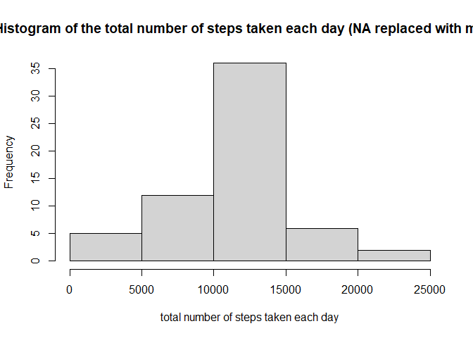

Reproducible Research -  Week 2 Course Project 1
========================================================

## Loading and preprocessing the data
1. Load the data (i.e. read.csv())
2. Process/transform the data (if necessary) into a format suitable for your analysis

The data file is downloaded from `https://d396qusza40orc.cloudataront.net/repdata%2Fdata%2Factivity.zip`
Unzip the data file `activity.csv` and to be placed in the same directory as this R markdown (`PA1_template.Rmd`). 

### Read the data into `data`

```r
data <- read.csv("activity.csv")
head(data)
```

```
##   steps       date interval
## 1    NA 2012-10-01        0
## 2    NA 2012-10-01        5
## 3    NA 2012-10-01       10
## 4    NA 2012-10-01       15
## 5    NA 2012-10-01       20
## 6    NA 2012-10-01       25
```

### Pre-process the data

```r
# format the date
data$date <- as.Date(data$date , format = "%Y-%m-%d")

# create dataframe with total steps per day
stepsperday <- aggregate(data$steps, by=list(data$date), sum)
names(stepsperday)[1] <-"day"
names(stepsperday)[2] <-"steps"
head(stepsperday)
```

```
##          day steps
## 1 2012-10-01    NA
## 2 2012-10-02   126
## 3 2012-10-03 11352
## 4 2012-10-04 12116
## 5 2012-10-05 13294
## 6 2012-10-06 15420
```

```r
# create dataframe with total steps per interval
stepsperinterval <- aggregate(data$steps, by=list(data$interval), sum, na.rm=TRUE, na.action=NULL)
names(stepsperinterval)[1] <-"interval"
names(stepsperinterval)[2] <-"steps"
head(stepsperinterval)
```

```
##   interval steps
## 1        0    91
## 2        5    18
## 3       10     7
## 4       15     8
## 5       20     4
## 6       25   111
```

## What is mean total number of steps taken per day?
1. Make a histogram of the total number of steps taken each day
2. Calculate and report the mean and median total number of steps taken per day


### Histogram of the total number of steps taken each day

```r
hist(stepsperday$steps, 
     main = "Histogram of the total number of steps taken each day",
     ylab="Count",
     xlab = "total number of steps taken each day")
```

<!-- -->

### The mean and median total number of steps taken per day

Mean number of steps per day:

```r
mean(stepsperday$steps, na.rm = TRUE)
```

```
## [1] 10766.19
```
Median number of steps per day:

```r
median(stepsperday$steps, na.rm = TRUE )
```

```
## [1] 10765
```

# What is the average daily activity pattern?
1. Make a time series plot (i.e. type = "l") of the 5-minute interval (x-axis)
and the average number of steps taken, averaged across all days (y-axis)
2. Which 5-minute interval, on average across all the days in the dataset,
contains the maximum number of steps?

### Time series plot

```r
# create dataframe with mean steps per interval
meanstepsperinterval <- aggregate(data$steps, by=list(data$interval), mean, na.rm=TRUE, na.action=NULL)
names(meanstepsperinterval)[1] <-"interval"
names(meanstepsperinterval)[2] <-"mean.steps"
head(meanstepsperinterval)
```

```
##   interval mean.steps
## 1        0  1.7169811
## 2        5  0.3396226
## 3       10  0.1320755
## 4       15  0.1509434
## 5       20  0.0754717
## 6       25  2.0943396
```

```r
plot(meanstepsperinterval$interval, meanstepsperinterval$mean.steps, type="n", 
     main="Time Series Plot per 5-minute interval",
     xlab = "5-minute intervals",
     ylab = "Average number of steps taken") 
lines(meanstepsperinterval$interval, meanstepsperinterval$mean.steps,type="l") 
```

<!-- -->

### Maximum number of steps
5-minute interval with maximum number of steps:

```r
meanstepsperinterval[which.max(meanstepsperinterval$mean.steps),1]
```

```
## [1] 835
```
The maximum number of steps = 

```r
max(meanstepsperinterval$mean.steps, na.rm = TRUE)
```

```
## [1] 206.1698
```

# Inputing missing values
1. Calculate and report the total number of missing values in the dataset (i.e. the total number of rows with NAs)
2. Devise a strategy for filling in all of the missing values in the dataset. The strategy does not need to be sophisticated. For example, you could use the mean/median for that day, or the mean for that 5-minute interval, etc.
3. Create a new dataset that is equal to the original dataset but with the missing data filled in.
4. Make a histogram of the total number of steps taken each day and Calculate and report the mean and median total number of steps taken per day. Do these values differ from the estimates from the first part of the assignment? What is the impact of imputing missing data on the estimates of the total
daily number of steps?

### Missing values
Total number of missing values in the dataset:

```r
sum(is.na(data$steps))
```

```
## [1] 2304
```

### Fill in missing values
Replacing the missing values using the mean for the interval


```r
missingdata <- merge(data, meanstepsperinterval, by = "interval", sort= FALSE)
missingdata <- missingdata[with(missingdata, order(date,interval)), ] 

# replace with mean.steps 
missingdata$steps[is.na(missingdata$steps)] <- missingdata$mean.steps[is.na(missingdata$steps)] 
head(missingdata)
```

```
##     interval     steps       date mean.steps
## 1          0 1.7169811 2012-10-01  1.7169811
## 63         5 0.3396226 2012-10-01  0.3396226
## 128       10 0.1320755 2012-10-01  0.1320755
## 205       15 0.1509434 2012-10-01  0.1509434
## 264       20 0.0754717 2012-10-01  0.0754717
## 327       25 2.0943396 2012-10-01  2.0943396
```


### New dataset with missing data filled in

```r
newdata <- missingdata[, c(2,3,1)]
```

### Histogram of total number of steps

```r
# create dataframe with total steps per day
# different from before since this has NA replaced with mean steps per interval
newstepsperday <- aggregate(newdata$steps, by=list(newdata$date), sum)
names(newstepsperday)[1] <-"day"
names(newstepsperday)[2] <-"steps"
head(newstepsperday)
```

```
##          day    steps
## 1 2012-10-01 10766.19
## 2 2012-10-02   126.00
## 3 2012-10-03 11352.00
## 4 2012-10-04 12116.00
## 5 2012-10-05 13294.00
## 6 2012-10-06 15420.00
```

### Histogram of the total number of steps taken each day


```r
hist(newstepsperday$steps, 
     main = "Histogram of the total number of steps taken each day (NA replaced with mean)",
     xlab = "total number of steps taken each day")
```

<!-- -->

### The mean and median total number of steps taken per day

Mean number of steps per day:

```r
mean(newstepsperday$steps)
```

```
## [1] 10766.19
```
Median number of steps per day:

```r
median(newstepsperday$steps)
```

```
## [1] 10766.19
```
The Mean is equal to the estimates from the first part of the assignment.

The Median is slightly lower compared to the first part of the assignment.  

The histogram shows a similar pattern compared to the previous one but with overall higher frequencies since the NA has now been replaced with values. 


# Are there differences in activity patterns between weekdays and weekends?
1. Create a new factor variable in the dataset with two levels – “weekday” and “weekend” indicating whether a given date is a weekday or weekend day.
2. Make a panel plot containing a time series plot (i.e. type = "l") of the 5-minute interval (x-axis) and the average number of steps taken, averaged across all weekday days or weekend days (y-axis). 


### New factor variable


```r
newdatacopy <- newdata
newdatacopy$weekdays <- factor(format(newdatacopy$date,'%A'))

levels(newdatacopy$weekdays)
```

```
## [1] "Friday"    "Monday"    "Saturday"  "Sunday"    "Thursday"  "Tuesday"  
## [7] "Wednesday"
```

```r
levels(newdatacopy$weekdays) <- list("weekday" = c("Monday", "Tuesday", "Wednesday", "Thursday", "Friday"), "weekend" = c("Saturday", "Sunday"))
levels(newdatacopy$weekdays)
```

```
## [1] "weekday" "weekend"
```

### A panel plot with time series of 5-minute interval

```r
newdatacopy.mean.interval <- aggregate(newdatacopy$steps, by=list(newdatacopy$weekdays, newdatacopy$interval), mean, na.rm=TRUE, na.action=NULL)
names(newdatacopy.mean.interval)[1] <-"weekday"
names(newdatacopy.mean.interval)[2] <-"interval"
names(newdatacopy.mean.interval)[3] <-"mean.steps"
library(lattice) 
xyplot(newdatacopy.mean.interval$mean.steps ~ newdatacopy.mean.interval$interval | newdatacopy.mean.interval$weekday, 
       layout=c(1,2), 
       type="l",
       xlab = "Interval",
       ylab = "Number of steps")
```

<!-- -->

The plots show that there is a slight difference in activity patterns between weekday and weekend. For interval between 500 to 1000, the activity in weekday has higher number of steps, while for interval more than 1000, it shows that weekend has higher number of steps.    

